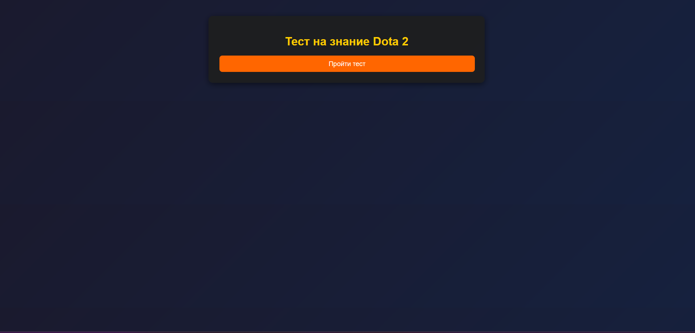
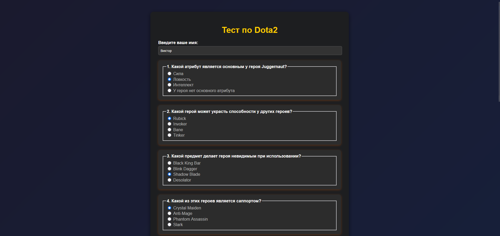
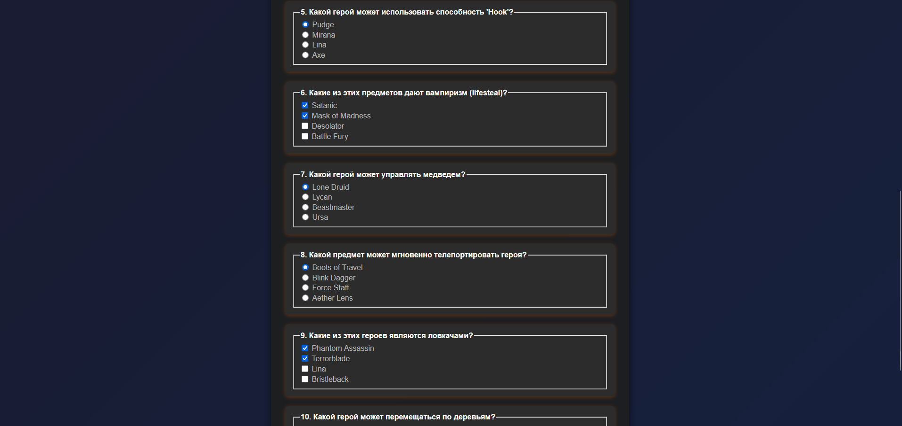
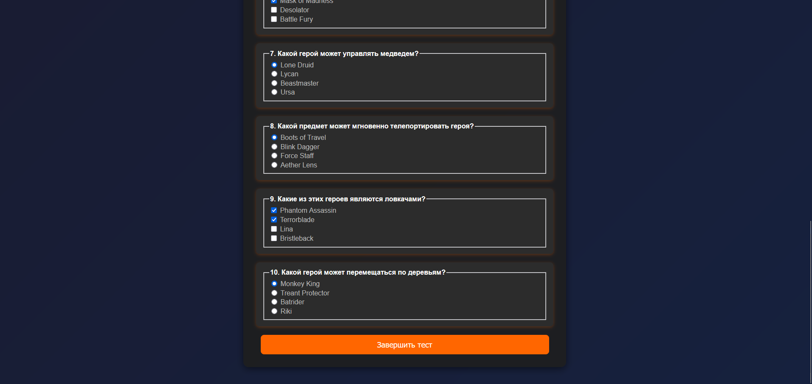
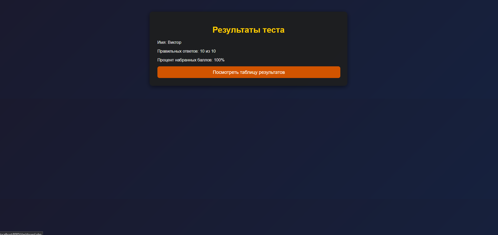
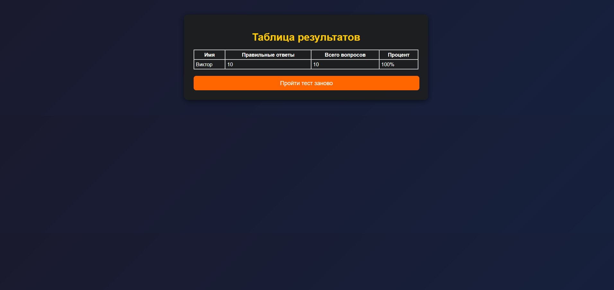

# Тест на знание Dota 2

## Инструкции по запуску

1. Убедитесь, что у вас установлен **PHP** (версии 7.4 и выше).
2. Скачайте файлы проекта.
3. Запустите локальный сервер с помощью команд:
   ```sh
   php -S localhost:8000
   ```
4. Перейдите в браузере по адресу: `http://localhost:8000/index.php`
5. Для прохождения теста нажмите кнопку **"Пройти тест"**.

## Краткое описание функционала приложения

Это веб-приложение для тестирования знаний по Dota 2. Пользователь вводит имя, отвечает на вопросы и получает оценку своего результата. Вопросы загружаются из JSON-файла, а результаты сохраняются и отображаются в таблице лидеров. Приложение проверяет правильность ответов, рассчитывает процент успешности и обеспечивает валидацию имени.

- Загрузка вопросов из JSON-файла.
- Прохождение теста с выбором одного или нескольких вариантов ответа.
- Проверка правильности ответов и расчет итогового балла.
- Сохранение результатов в JSON-файл.
- Отображение таблицы лидеров с процентами правильных ответов.
- Валидация имени пользователя (только буквы и пробелы).

## Примеры тестов

Пример вопроса в `questions.json`:
```json
{
    "question": "Какой атрибут является основным у героя Juggernaut?",
    "type": "single",
    "options": ["Сила", "Ловкость", "Интеллект", "У героя нет основного атрибута"],
    "correct": ["Ловкость"]
}
```

Пример результата в `results.json`:
```json
{
    "name": "Иван",
    "score": 8,
    "total": 10,
    "percent": 80.00
}
```

## Структура файлов

- `index.php` – Главная страница с кнопкой для начала теста.
- `test.php` – Страница с вопросами и формой для ввода ответов.
- `result.php` – Подсчет баллов и отображение результатов.
- `dashboard.php` – Таблица с результатами тестов.
- `functions.php` – Функции для работы с JSON-файлами.
- `questions.json` – Файл с вопросами.
- `results.json` – Файл с результатами пользователей.
- `style.css` – Стили оформления.

## Структура JSON-файлов

### **1. `questions.json` (Структура вопросов)**  
```json
[
    {
        "question": "string",      // Текст вопроса
        "type": "string",          // Тип вопроса: "single" (один ответ) или "multiple" (несколько ответов)
        "options": ["string"],     // Варианты ответов
        "correct": ["string"]      // Правильные ответы
    }
]
```

---

### **2. `results.json` (Структура результатов тестов)**  
```json
[
    {
        "name": "string",         // Имя пользователя
        "score": "integer",       // Количество правильных ответов
        "total": "integer",       // Общее количество вопросов
        "percent": "float"        // Процент правильных ответов
    }
]
```

## Скриншоты

1. **Главная страница**
   

2. **Прохождение теста**
   
   
   

3. **Результаты теста**
   

4. **Таблица лидеров**
   
